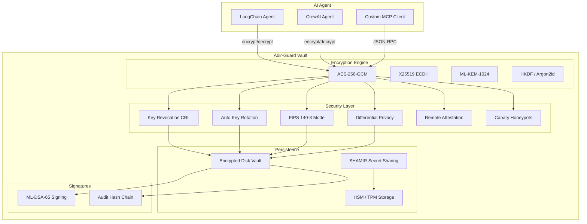

# Abir-Guard v3.2.0 — Quantum-Resilient Agentic Vault for AI Agent Memory

<p align="center">
  <strong>A post-quantum vault for AI agent memory. Protects agent data against Harvest Now, Decrypt Later attacks with ML-KEM-1024 + ML-DSA-65.</strong>
</p>

<p align="center">
  <a href="https://github.com/Abiress/abir-guard"></a>
  <a href="https://pypi.org/project/abir-guard/"></a>
  <a href="https://crates.io/crates/abir_guard"></a>
  <a href="https://github.com/Abiress/abir-guard"></a>
  <a href="https://github.com/Abiress/abir-guard"></a>
  <a href="https://github.com/Abiress/abir-guard"></a>
  <a href="https://github.com/Abiress/abir-guard"></a>
</p>

<p align="center">
  <a href="https://github.com/Abiress/abir-guard/blob/master/abir_guard/ml_kem.py"></a>
  <a href="https://github.com/Abiress/abir-guard/blob/master/abir_guard/ml_kem.py"></a>
  <a href="https://github.com/Abiress/abir-guard/blob/master/abir_guard/ml_kem.py"></a>
  <a href="https://github.com/Abiress/abir-guard/blob/master/abir_guard/fips_mode.py"></a>
  <a href="https://github.com/Abiress/abir-guard/blob/master/LICENSE"></a>
</p>

<p align="center">
  <a href="https://github.com/Abiress/abir-guard/actions"></a>
  <a href="https://github.com/Abiress/abir-guard"></a>
  <a href="https://github.com/Abiress/abir-guard"></a>
  <a href="https://github.com/Abiress/abir-guard"></a>
</p>

---

```diff
- Legacy memory storage is a ticking time bomb. Quantum computers will decrypt it.
+ Abir-Guard: A post-quantum vault built for AI agents.
```

> **The Harvest Now, Decrypt Later threat is real.** Adversaries are collecting your encrypted agent memory today — waiting for quantum computers to decrypt it tomorrow. Abir-Guard stops them with NIST-standard post-quantum cryptography deployed today.

---

## At a Glance

| Category | Highlights |
|---|---|
| **Quantum-Safe** | ML-KEM-1024 (production-ready), ML-DSA-65, X25519 hybrid KEM, AES-256-GCM envelope encryption |
| **Multi-Language** | Python SDK, Rust CLI + Library, Go SDK, JavaScript SDK |
| **AI Native** | LangChain tools, CrewAI agents, MCP JSON-RPC server, HTTP MCP API |
| **Hardened** | FIPS 140-3 mode, key revocation (CRL), auto rotation, remote attestation, differential privacy, canary honeypots, tamper-evident audit logs |
| **Hardware Ready** | YubiKey/FIDO2, TPM 2.0 seal/unseal, Apple Secure Enclave, Intel SGX detection, HSM integration, zero-copy memory policy, Argon2id KDF (OWASP params) |
| **Tested** | Rust: 176 lib + 2 CLI tests passing, Go SDK tests passing, Python SDK smoke tests passing |

---

## Why Abir-Guard?

This section is intentionally limited to claims that are verifiable from this repository and local benchmark runs.

| Capability | Evidence in this repo | Status |
|---|---|---|
| Post-quantum KEM | [abir_guard/ml_kem.py](https://github.com/Abiress/abir-guard/blob/master/abir_guard/ml_kem.py), [src/quantum_kernel.rs](https://github.com/Abiress/abir-guard/blob/master/src/quantum_kernel.rs) | ✅ Present |
| Post-quantum signatures | [src/ml_dsa.rs](https://github.com/Abiress/abir-guard/blob/master/src/ml_dsa.rs) | ✅ Present |
| AI-agent integrations | [abir_guard/langchain.py](https://github.com/Abiress/abir-guard/blob/master/abir_guard/langchain.py), [abir_guard/crewai.py](https://github.com/Abiress/abir-guard/blob/master/abir_guard/crewai.py), [abir_guard/mcp_http.py](https://github.com/Abiress/abir-guard/blob/master/abir_guard/mcp_http.py) | ✅ Present |
| Multi-language SDKs | [abir_guard](https://github.com/Abiress/abir-guard/tree/master/abir_guard), [src](https://github.com/Abiress/abir-guard/tree/master/src), [sdk/go](https://github.com/Abiress/abir-guard/tree/master/sdk/go), [sdk/js](https://github.com/Abiress/abir-guard/tree/master/sdk/js) | ✅ Present |
| Hardware security hooks | [abir_guard/yubikey_integration.py](https://github.com/Abiress/abir-guard/blob/master/abir_guard/yubikey_integration.py), [abir_guard/tpm2_seal.py](https://github.com/Abiress/abir-guard/blob/master/abir_guard/tpm2_seal.py), [abir_guard/hardware_enclave.py](https://github.com/Abiress/abir-guard/blob/master/abir_guard/hardware_enclave.py) | ✅ Present |
| Cloud KMS envelope module | [abir_guard/cloud_kms.py](https://github.com/Abiress/abir-guard/blob/master/abir_guard/cloud_kms.py) | ✅ Present |
| HashiCorp Vault transit client | [abir_guard/hashicorp_vault.py](https://github.com/Abiress/abir-guard/blob/master/abir_guard/hashicorp_vault.py) | ✅ Present |
| Kubernetes operator helpers | [abir_guard/kubernetes_operator.py](https://github.com/Abiress/abir-guard/blob/master/abir_guard/kubernetes_operator.py) | ✅ Present |
| Multi-tenant RBAC module | [abir_guard/rbac.py](https://github.com/Abiress/abir-guard/blob/master/abir_guard/rbac.py) | ✅ Present |
| OpenTelemetry facade | [abir_guard/telemetry.py](https://github.com/Abiress/abir-guard/blob/master/abir_guard/telemetry.py) | ✅ Present |
| FIPS-mode policy module | [abir_guard/fips_mode.py](https://github.com/Abiress/abir-guard/blob/master/abir_guard/fips_mode.py) | ✅ Present |
| Auto key rotation | [abir_guard/rotation.py](https://github.com/Abiress/abir-guard/blob/master/abir_guard/rotation.py), [src/rotation.rs](https://github.com/Abiress/abir-guard/blob/master/src/rotation.rs) | ✅ Present |
| Remote attestation | [abir_guard/attestation.py](https://github.com/Abiress/abir-guard/blob/master/abir_guard/attestation.py), [src/confidential_computing](https://github.com/Abiress/abir-guard/tree/master/src/confidential_computing) | ✅ Present |
| Differential privacy | [abir_guard/differential_privacy.py](https://github.com/Abiress/abir-guard/blob/master/abir_guard/differential_privacy.py), [src/differential_privacy.rs](https://github.com/Abiress/abir-guard/blob/master/src/differential_privacy.rs) | ✅ Present |
| Canary honeypot support | [abir_guard/__init__.py](https://github.com/Abiress/abir-guard/blob/master/abir_guard/__init__.py) | ✅ Present |

### Benchmark Snapshot (Local, 2026-05-12)

| Metric | Command | Result |
|---|---|---|
| Rust release binary size | `ls -lh target/release/abir-guard` | `766K` |
| Rust CLI startup footprint | `/usr/bin/time ./target/release/abir-guard --help` | `0.00s`, `2688 KB` max RSS |
| Rust lib tests (release) | `cargo test --lib --release` | `176/176` passing, tests finished in `0.67s` |
| Python SDK throughput | 5000 keygen+encrypt+decrypt loop | `18,956 ops/s` |
| Python SDK memory | same benchmark via `/usr/bin/time` | `48,204 KB` max RSS |
| Go SDK representative path | `go test -run TestEncryptDecrypt -v ./...` | pass, `0.03s`, `25,688 KB` max RSS |
| Phase 5 prompt shield throughput | 20,000 `analyze()` calls | `347,999 ops/s` |
| Phase 5 model weight roundtrip | 1 MiB encrypt + decrypt (`mock` KMS) | `4.77 ms` |
| Phase 5 red-team simulation | curated scenario run | score `1.00`, runtime `0.029 ms` |

### Scope Note

Comparative claims against external products (for example HashiCorp Vault or AWS KMS) are intentionally omitted here unless benchmarked under the same test protocol and linked to authoritative vendor documentation.

---

## System Architecture



---

## Table of Contents

- [Overview](#overview)
- [Use Cases](#use-cases)
- [Prerequisites & Installation](#prerequisites--installation)
- [Quick Start](#quick-start)
- [Python SDK Guide](#python-sdk-guide)
- [Rust CLI & Library Guide](#rust-cli--library-guide)
- [Go SDK Guide](#go-sdk-guide)
- [JavaScript SDK Guide](#javascript-sdk-guide)
- [MCP Server Guide](#mcp-server-guide)
- [LangChain & CrewAI Integration](#langchain--crewai-integration)
- [Docker Deployment](#docker-deployment)
- [HSM & TPM Integration](#hsm--tpm-integration)
- [Quantum Readiness](#quantum-readiness)
- [Security Architecture](#security-architecture)
- [Validation](#validation)
- [Project Structure](#project-structure)
- [Roadmap](#roadmap)
- [Contributing](#contributing)
- [License](#license)
- [Developer](#developer)

---

## Overview

Abir-Guard is a production-grade, quantum-resistant encryption vault built for AI agent memory and sensitive data protection. It implements NIST-standard Post-Quantum Cryptography (PQC) to defend against **Harvest Now, Decrypt Later (HNDL)** attacks — where adversaries collect encrypted data today to decrypt once quantum computers become powerful enough.

**Three-phase implementation:**
1. **Bedrock** — Hybrid KEM, AES-256-GCM, zero-copy memory, MCP server, LangChain/CrewAI SDKs
2. **Hardware & Security** — ML-DSA-65 signatures, SHAMIR secret sharing, Argon2id KDF, HSM/TPM
3. **Ecosystem & Hardening** — Key revocation (CRL), auto rotation, FIPS 140-3 mode, differential privacy, remote attestation, Go SDK

**Written in three languages** for maximum portability: Python for AI agent integration, Rust for high-performance cryptography, Go for infrastructure tooling, and JavaScript for browser and Node.js environments.

---

## Use Cases

### 1. Protecting AI Agent API Keys
AI agents frequently handle API keys, OAuth tokens, and service credentials. Abir-Guard encrypts these at rest and in memory, ensuring no raw secrets leak through memory dumps, swap files, or process inspection.

```python
vault.store("gpt_agent", b"OPENAI_API_KEY=sk-...")
```

### 2. Secure Agent-to-Agent Communication
Use the MCP JSON-RPC server as a local encryption gateway. Agents send plaintext to the server; encryption happens locally without exposing data to LLM context or consuming tokens.

### 3. Regulatory Compliance (FIPS 140-3)
Enable strict FIPS mode to enforce NIST-approved algorithms only, block non-compliant fallbacks, enforce minimum key lengths, and maintain audit trails for compliance audits.

```python
from abir_guard.fips_mode import FIPSEncryptor
fips = FIPSEncryptor()
result = fips.encrypt(data, key)
```

### 4. Multi-Party Key Recovery (SHAMIR)
Split master secrets across trusted parties. A 3-of-5 SHAMIR scheme means any three administrators can reconstruct the master key, but fewer than three learn nothing.

```bash
./target/release/abir-guard shamir-split "master-key" -t 3 -n 5
```

### 5. Breach Detection via Canary Keys
Plant honeypot keys that alert when accessed. If an attacker compromises the vault and uses a canary key, you know immediately.

```python
canary_id = vault.add_canary()
if vault.check_canary():
    alert_security_team("Breach detected!")
```

### 6. Automatic Key Lifecycle Management
Configure time-based or usage-based key rotation. Keys automatically expire after N operations or N hours, reducing the window of exposure from compromised keys.

```python
rotation_manager.register_key("agent-1", max_operations=1000)
```

### 7. Remote Attestation for Decryption Gates
Before decrypting sensitive data, verify the runtime environment is untampered — checking binary integrity, environment variables, and memory canaries.

```python
from abir_guard.attestation import AttestationVerifier
verifier = AttestationVerifier()
proof = IntegrityProof()
proof.compute(challenge)
if not verifier.verify_proof(proof.to_dict()):
    raise Exception("Runtime integrity check failed")
```

### 8. Post-Quantum Digital Signatures (ML-DSA-65)
Sign and verify data integrity using NIST FIPS 204 ML-DSA-65 — post-quantum secure, tamper-evident, non-repudiation guarantees.

```rust
let keypair = ml_dsa::generate_keypair().unwrap();
let signature = ml_dsa::sign(b"agent-memory", &keypair.signing_key).unwrap();
```

### 9. Federated Multi-Region Vault Mesh (CRDT)
Replicate encrypted key records across regions using signed CRDT deltas with deterministic conflict resolution, so partitions and retries converge safely.

```python
from abir_guard.federated_vault import FederatedVaultNode

a = FederatedVaultNode("us-east-1", b"cluster-key")
b = FederatedVaultNode("eu-west-1", b"cluster-key")
a.put("agent-a", "Y2lwaGVydGV4dA==")
b.apply_delta(a.export_delta("agent-a"))
```

### 10. Hybrid PQ-TLS Session Bootstrap
Combine ML-KEM and X25519 secrets into a TLS 1.3 exporter key for secure transport bootstrapping and phased migration toward PQ-only channels.

### 11. DID + Verifiable Credentials for Agent Identity
Issue and verify signed credentials for agent identities, enabling decentralized trust and policy-driven authorization.

### 12. Multi-HSM Cluster Failover
Route signing operations to healthy HSM providers with regional preference and automatic failover for high-availability key services.

---

## Prerequisites & Installation

### System Requirements

| Component | Minimum | Recommended |
|---|---|---|
| OS | Linux, macOS, Windows | Ubuntu 22.04+, macOS 13+, Windows 11 |
| CPU | x86_64, ARM64 | Any modern multi-core |
| RAM | 128 MB | 256 MB+ (Argon2id uses 64 MB) |
| Disk | 50 MB | 100 MB |

### Python SDK

```bash
# Prerequisites: Python 3.10+
python3 --version  # Must be 3.10 or higher

# Install package and dev dependencies
pip install -e ".[dev]"

# Optional: LangChain/CrewAI integration
pip install crewai langchain-core
```

### Rust CLI + Library

```bash
# Prerequisites: Rust 1.70+ via rustup
curl --proto '=https' --tlsv1.2 -sSf https://sh.rustup.rs | sh
source "$HOME/.cargo/env"
rustc --version  # Must be 1.70 or higher

# Build release binary
cargo build --release

# Install as CLI tool
cargo install --path .
```

### Go SDK

```bash
# Prerequisites: Go 1.21+
# macOS: brew install go
# Linux: sudo apt install golang-go
# Windows: download from https://go.dev/dl/

go version  # Must be 1.21 or higher

# Download module dependencies
cd sdk/go && go mod tidy

# Run tests
go test -v
```

### JavaScript SDK

```bash
# Prerequisites: Node.js 18+
node --version  # Must be 18 or higher

# SDK is built-in — no npm install needed
# Usage: const { AbirGuard } = require('./src/abir_guard');
```

### Docker

```bash
# Prerequisites: Docker Engine 20.10+
docker --version

# Build and run
docker build -t abir-guard:latest .
docker run -d -p 9090:9090 -e ABIR_GUARD_API_KEY="your-key" abir-guard:latest
```

---

## Quick Start

### Install from Package Managers (Recommended)

```bash
# Python (PyPI)
pip install abir-guard

# Rust (crates.io)
cargo add abir_guard

# Go (GitHub)
go get github.com/Abiress/abir-guard/sdk/go
```

### From Source

```bash
# Clone and install all components
git clone https://github.com/Abiress/abir-guard.git
cd abir-guard

# Python: install package
pip install -e ".[dev]"

# Rust: build and test
cargo build --release && cargo test

# Go: test
cd sdk/go && go test -v && cd ../..

# JavaScript: verify (Node.js)
node -e "const { AbirGuard } = require('./sdk/js/abir_guard'); new AbirGuard().generateKeyPair('test').then(console.log)"
```

---

## Python SDK Guide

### Basic Vault Operations

```python
from abir_guard import Vault

vault = Vault()

# Generate keypair for an agent
pub, sec = vault.generate_keypair("finance_agent")

# Encrypt sensitive data
ct = vault.store("finance_agent", b"API_KEY=sk-abc123xyz")

# Decrypt data
plaintext = vault.retrieve("finance_agent", ct)
# → b"API_KEY=sk-abc123xyz"

# Auto-generate keys on first use
ct = vault.store("new_agent", b"data")  # keypair created automatically

# List and delete keys
vault.list_keypairs()        # ['finance_agent', 'new_agent']
vault.remove_keypair("new_agent")
```

### Phase 3 Features

```python
# Key Revocation (CRL)
from abir_guard.revocation import RevocationList, RevocationReason
crl = RevocationList()
crl.revoke("compromised-key", RevocationReason.COMPROMISED, "admin", "Key leaked")
crl.is_revoked("compromised-key")  # True

# Automatic Key Rotation
from abir_guard.rotation import KeyRotationManager
mgr = KeyRotationManager(default_max_operations=1000)
mgr.register_key("agent-1", max_operations=500)
mgr.record_usage("agent-1", "encrypt")
mgr.needs_rotation("agent-1")  # False (under limit)

# FIPS 140-3 Compliance Mode
from abir_guard.fips_mode import FIPSEncryptor
fips = FIPSEncryptor()
encrypted = fips.encrypt(data, key)
decrypted = fips.decrypt(ct, tag, nonce, key)

# Differential Privacy Entropy
from abir_guard.differential_privacy import DifferentialEntropyCollector
collector = DifferentialEntropyCollector(epsilon=0.5, sample_count=20)
entropy = collector.collect()  # 32 bytes of noise-injected entropy

# Remote Attestation
from abir_guard.attestation import IntegrityProof, AttestationVerifier
proof = IntegrityProof()
proof.compute(challenge="abc123")
verifier = AttestationVerifier()
verifier.verify_proof(proof.to_dict())  # True if untampered
```

### MCP HTTP Server

```python
from abir_guard.mcp_http import McpHttpServer

server = McpHttpServer(port=9090, api_key="your-secret-key", rate_limit=100)
server.start()

# curl http://localhost:9090/health
# curl -X POST http://localhost:9090 -H "Authorization: Bearer your-secret-key" ...
```

---

## Rust CLI & Library Guide

### CLI Commands

```bash
# Initialize vault with passphrase
./target/release/abir-guard -k "my-passphrase" init my-agent

# Encrypt / decrypt
./target/release/abir-guard -k "my-passphrase" encrypt my-agent "secret data"
./target/release/abir-guard -k "my-passphrase" decrypt my-agent "<ciphertext>" "<nonce>"

# SHAMIR secret sharing
./target/release/abir-guard shamir-split "my-passphrase" -t 3 -n 5
./target/release/abir-guard shamir-join "1:..." "3:..." "5:..."

# ML-DSA signatures
./target/release/abir-guard -k "my-passphrase" mldsa-init --key-id agent
./target/release/abir-guard -k "my-passphrase" mldsa-sign agent "data"

# Start MCP server
./target/release/abir-guard mcp-server --mode stdio
```

### Library Usage

```rust
use abir_guard::Vault;

let vault = Vault::new();
let ct = vault.store(b"agent-1", b"secret data").unwrap();
let plain = vault.retrieve(b"agent-1", &ct).unwrap();
assert_eq!(plain, b"secret data");
```

Persistent vault with passphrase:

```rust
use abir_guard::persistent_vault;

let vault = persistent_vault::get_vault("my-passphrase");
let ct = persistent_vault::store_encrypted(&vault, "agent", b"secret", "my-passphrase").unwrap();
```

---

## Go SDK Guide

```go
import "github.com/abir-guard/abir-guard/sdk/go"

vault := abirguard.NewVault()

// Generate keypair
vault.GenerateKeypair("agent-1")

// Encrypt / decrypt
ct, _ := vault.Encrypt("agent-1", []byte("sensitive data"))
plain, _ := vault.Decrypt("agent-1", ct)

// Revoke key
vault.RevokeKey("compromised", "compromised", "admin", "Key leaked")

// Rotate key
vault.RotateKey("agent-1")

// Check rotation status
meta, _ := vault.GetMetadata("agent-1")
fmt.Printf("Operations: %d encrypt, %d decrypt\n", meta.EncryptCount, meta.DecryptCount)

// Audit log
for _, entry := range vault.GetAuditLog() {
    fmt.Printf("[%s] %s: %s\n", entry.Timestamp, entry.Action, entry.KeyID)
}
```

---

## JavaScript SDK Guide

```javascript
const { AbirGuard, AbirGuardMCP, AbirGuardBrowserExtension } = require('./sdk/js/abir_guard');

const vault = new AbirGuard();

const { publicKey } = await vault.generateKeyPair('agent-1');
const { ciphertext, nonce, authTag } = await vault.encrypt('agent-1', 'API_KEY=sk-...');
const plaintext = await vault.decrypt('agent-1', { ciphertext, nonce, authTag });

// Phase 5 PQC adapters (provider-backed or simulated fallback)
const kem = await vault.generateMlKemKeyPair();
const enc = await vault.kemEncapsulate(kem.publicKey);
const dec = await vault.kemDecapsulate(enc.ciphertext, kem.secretKey);

const dsa = await vault.generateMlDsaKeyPair();
const sig = await vault.mlDsaSign('message', dsa.secretKey);
const ok = await vault.mlDsaVerify('message', sig.signature, dsa.publicKey);

// Rotate key (kill switch)
await vault.rotateKey('agent-1');

// MCP client
const mcp = new AbirGuardMCP(9090);
const result = await mcp.encrypt('agent-1', 'secret data');

// Browser extension runtime bridge (Manifest V3)
// const ext = new AbirGuardBrowserExtension(chrome.runtime);
// await ext.sendSecureMessage('vault.encrypt', { keyId: 'agent-1', data: 'secret' });
```

---

## MCP Server Guide

### JSON-RPC Methods

| Method | Params | Response | Description |
|--------|--------|----------|-------------|
| `generate_key` | `{key_id}` | `{key_id, generated: true}` | Create keypair |
| `encrypt` | `{key_id, data}` | `{nonce, ciphertext, key_id}` | Encrypt data |
| `decrypt` | `{key_id, ciphertext}` | `{plaintext}` | Decrypt data |
| `list_keys` | `{}` | `{keys: [...]}` | List active keys |
| `delete_key` | `{key_id}` | `{deleted: true}` | Remove keypair |
| `add_canary` | `{}` | `{canary_id}` | Plant honeypot key |
| `check_canary` | `{}` | `{breach_detected: bool}` | Check for breaches |
| `audit_log` | `{limit}` | `{entries: [...]}` | View audit log |
| `clear_cache` | `{}` | `{cleared: true}` | Clear memory cache |
| `info` | `{}` | `{name, version, mcp_version}` | Server info |

### HTTP Endpoints

| Endpoint | Auth | Description |
|----------|------|-------------|
| `POST /` | Bearer token | MCP JSON-RPC gateway |
| `GET /health` | Public | Health check |
| `GET /audit` | Bearer token | Last 100 audit entries |

---

## LangChain & CrewAI Integration

### LangChain

```python
from abir_guard.langchain import get_langchain_tools

tools = get_langchain_tools()
# [SilentQKeyGenTool, SilentQEncryptTool, SilentQDecryptTool]
```

### CrewAI

```python
from abir_guard.crewai import get_crewai_tools

tools = get_crewai_tools()
# [KeyGenCrewTool, EncryptCrewTool, DecryptCrewTool]
```

---

## Docker Deployment

```bash
# Build image
docker build -t abir-guard:latest .

# Run with API key and persistent volume
docker run -d --name abir-guard \
  -p 9090:9090 \
  -e ABIR_GUARD_API_KEY="your-secret-key" \
  -v abir-keys:/root/.abir_guard \
  abir-guard:latest

# Health check
curl http://localhost:9090/health

# Encrypt via HTTP
curl -X POST http://localhost:9090 \
  -H "Authorization: Bearer your-secret-key" \
  -H "Content-Type: application/json" \
  -d '{"jsonrpc":"2.0","id":1,"method":"encrypt","params":{"key_id":"agent","data":"secret"}}'
```

---

## HSM & TPM Integration

```python
from abir_guard.abir_hsm import HSMKeyStore, TPMKeyStore

# Auto-detect best backend per OS
hsm = HSMKeyStore()
# macOS → Keychain, Windows → Credential Manager, Linux → file/secret_service

hsm.store_secret("my-api-key", b"sk-abc123")
secret = hsm.retrieve_secret("my-api-key")

# TPM 2.0 hardware detection
tpm = TPMKeyStore()
if tpm.is_available():
    print("TPM hardware detected — keys can be hardware-sealed")
```

## Phase 2 Hardware Security Features

### YubiKey / FIDO2 Integration

```python
from abir_guard import YubiKeyManager

yk = YubiKeyManager()

# Generate hardware-backed key
cred_id = yk.generate_key("agent-1", "ed25519")

# Sign data (requires YubiKey touch in production)
signature = yk.sign("agent-1", b"data to sign")

# Encrypt/decrypt with YubiKey-backed keys
ct, nonce = yk.encrypt_with_yubikey("agent-1", b"secret")
plaintext = yk.decrypt_with_yubikey("agent-1", ct, nonce)
```

### TPM 2.0 Seal/Unseal

```python
from abir_guard import TPM2Sealer

tpm = TPM2Sealer()

# Seal data to TPM PCR values (hardware-bound)
sealed = tpm.seal(b"master-key", pcr_indices=[0, 7])

# Unseal - only works if system state matches
recovered = tpm.unseal(sealed)
```

### Hardware Enclave Detection

```python
from abir_guard import HardwareEnclave

enc = HardwareEnclave()
print(f"Platform: {enc.platform}")
print(f"Available: {enc.is_available()}")

# Generate hardware-backed key
enc.generate_key("agent-1")

# Seal/unseal using best available hardware
sealed = enc.seal(b"secret", "agent-1")
recovered = enc.unseal(sealed, "agent-1")

# Get attestation report
report = enc.attest(b"challenge-nonce")
```

---

## Quantum Readiness

### What "Quantum-Ready" Means for Abir-Guard

| Threat | Mitigation | Status |
|---|---|---|
| **Harvest Now, Decrypt Later** | ML-KEM-1024 key encapsulation (NIST FIPS 203) | Production Ready |
| **Quantum Key Extraction** | AES-256-GCM with 256-bit keys (Grover-resistant) | Production |
| **Signature Forgery (Shor's)** | ML-DSA-65 digital signatures (NIST FIPS 204) | Production |
| **Side-Channel Quantum Attacks** | Differential privacy entropy + constant-time comparison | Production |
| **Memory Scraping** | Zero-copy memory policy + explicit key zeroization | Production |
| **Future Quantum Break** | Hybrid KEM (ML-KEM + X25519) — both must break | Production |

### Current Quantum Status

- **AES-256-GCM**: Quantum-safe. Grover's algorithm reduces effective strength to 128-bit, still secure.
- **ML-DSA-65**: Post-quantum signatures deployed and tested. 3309-byte signatures, constant-time operations.
- **ML-KEM-1024**: Production-ready. Implemented in Python via `pqcrypto` (PQClean-backed) and Rust via `ml-kem` crate (pure Rust). Full keygen, encapsulation, and decapsulation roundtrip verified.
- **SHAMIR + Argon2id**: Classical but quantum-safe for their use cases (threshold sharing, key derivation).

### Strict PQ Runtime (Production)

- Install PQ backend: `pip install "abir-guard[pqcrypto]"` (or `pip install pqcrypto`).
- Enforce fail-fast behavior when PQ backend is missing:

```bash
export ABIR_GUARD_REQUIRE_PQ=true
```

- With `ABIR_GUARD_REQUIRE_PQ=true`, `MLKEM1024` raises `SecurityException` instead of falling back to X25519.

### Mission Alignment 🇮🇳🌍

This project aligns with and supports:

- **🇮🇳 Indian Quantum Mission** — India's National Quantum Mission (NQM) aims to develop quantum technologies for communication, computing, and sensing. Abir-Guard provides NIST-standard post-quantum cryptography to safeguard India's quantum infrastructure against Harvest Now, Decrypt Later threats.
- **🌍 Global Quantum Mission** — Aligns with the worldwide transition to post-quantum cryptography as mandated by NIST, ENISA, and national cybersecurity agencies. Abir-Guard implements NIST FIPS 203 (ML-KEM) and FIPS 204 (ML-DSA) for quantum-resilient data protection.
- **🇮🇳🌍 Indian AI Mission** — Supports India's AI sovereignty initiative by providing quantum-secure memory vaults for AI agents, ensuring API keys, model weights, and agent memory remain protected against future quantum attacks. Built in India, for the world.

### After Quantum Breakthrough

1. All ML-KEM-1024 backends are production-ready — no additional setup needed
2. Python uses `pqcrypto` (PQClean-backed) for native ML-KEM-1024
3. Rust uses `ml-kem` crate (pure Rust, zero dependencies)
4. Existing hybrid keys remain valid during transition

---

## Security Architecture

### Hybrid KEM Design

```
┌──────────────────────────────────────────────────────────┐
│              Hybrid Key Encapsulation                     │
│  ML-KEM-1024 (PQC)  +  X25519 (Classical ECDH)          │
│  Security: Both must be broken to compromise              │
└──────────────────────────────────────────────────────────┘
                          │
                          ▼
┌──────────────────────────────────────────────────────────┐
│              Envelope Encryption                         │
│  AES-256-GCM (NIST FIPS 197)                            │
│  96-bit random nonce + 128-bit auth tag per message     │
└──────────────────────────────────────────────────────────┘
```

### Defense-in-Depth Layers

| Layer | Controls |
|---|---|
| **Cryptography** | AES-256-GCM, ML-KEM-1024, ML-DSA-65, Argon2id, HKDF-SHA256 |
| **Memory Safety** | Zero-copy policy, explicit key zeroization, Rust ownership model |
| **Network** | Bearer token auth, rate limiting (100/min), TLS support, localhost default |
| **Integrity** | SHA-256 hash-chain audit logs, HMAC-signed CRL, tamper-evident vault |
| **Runtime** | Remote attestation, canary honeypots, Spectre/Meltdown noise injection |
| **Lifecycle** | Auto key rotation (time/usage), revocation, expiry policies |
| **Compliance** | FIPS 140-3 strict mode, approved algorithms only, audit trail |

---

## Validation

```bash
# Core validation from this public source tree
cargo clippy --all-targets --all-features -- -D warnings
cargo test --all-targets
pytest tests/test_abir_guard.py tests/test_phase2_hardware.py tests/test_phase3.py tests/test_phase5.py -v
cd sdk/go && go test -v ./... && cd ../..
node sdk/js/abir_guard_test.js
```

**Note:** internal roadmap and Python test harness files may be kept local-only in some release workflows.

---

## Project Structure

```
abir_guard/
├── abir_guard/              # Python package (core + enterprise + phase5 + phase6 modules)
│   ├── __init__.py          # Core Vault, HybridEncryptor, McpServer, AuditLogger
│   ├── ml_kem.py            # ML-KEM-1024 + X25519 hybrid KEM (real ECDH)
│   ├── yubikey_integration.py # YubiKey/FIDO2 integration (software fallback)
│   ├── tpm2_seal.py         # TPM 2.0 seal/unseal (tpm2-tools CLI)
│   ├── hardware_enclave.py  # Apple SE, Intel SGX, AMD SEV detection
│   ├── langchain.py         # LangChain tool integration (3 tools)
│   ├── crewai.py            # CrewAI tool integration (version-compatible)
│   ├── abir_hsm.py          # HSM/TPM integration (Keychain, CredMgr, file, TPM)
│   ├── mcp_http.py          # Hardened HTTP MCP server (auth, rate limit, TLS)
│   ├── crypto_store.py      # Encrypted disk persistence (Argon2id + AES-GCM + HMAC)
│   ├── revocation.py        # CRL-style key revocation with HMAC signing
│   ├── rotation.py          # Automatic key rotation (time-based + usage-based)
│   ├── fips_mode.py         # FIPS 140-3 compliance mode (strict NIST algorithms)
│   ├── differential_privacy.py # Laplace noise entropy (Spectre/Meltdown defense)
│   ├── attestation.py       # Remote attestation (runtime integrity verification)
│   ├── model_weight_encryption.py # LLM weight encryption and fine-tuning artifact protection
│   ├── prompt_injection_shield.py # Prompt threat detection, signing, quarantine
│   ├── compliance.py        # GDPR/CCPA/HIPAA retention + erasure + audit exports
│   ├── multi_agent_key_sharing.py # Threshold sharing and quorum policies
│   ├── secure_enclave_llm.py # TDX/SEV-SNP style attested inference gate (simulated)
│   ├── zk_compliance.py     # Commitment-based compliance proofs
│   └── ai_red_team.py       # Automated AI red-team scenario runner
│   ├── federated_vault.py   # Federated CRDT vault mesh with signed replication deltas
│   ├── qkd_network.py       # BB84-style QKD network session simulation
│   ├── pq_tls.py            # Hybrid ML-KEM + X25519 TLS 1.3 key schedule helpers
│   ├── wasm_edge.py         # Browser/Deno/Cloudflare WASM target specifications
│   ├── native_enclave.py    # Apple Secure Enclave + Intel SGX native attestation surface
│   ├── did_identity.py      # DID documents and verifiable credential primitives
│   └── hsm_cluster.py       # Multi-HSM load balancing and regional failover router
├── src/                     # Rust source (core + advanced secret sharing + blockchain + interop + QKD + confidential computing)
│   ├── lib.rs               # Library entry point + re-exports
│   ├── main.rs              # CLI binary (clap subcommands, passphrase, validation)
│   ├── quantum_kernel.rs    # Hybrid encryption + 200ms watchdog + zeroization
│   ├── entropy_inject.rs    # CPU jitter entropy collector
│   ├── zero_copy.rs         # Zero-copy vault with LRU-encrypted cache
│   ├── mcp_gateway.rs       # MCP JSON-RPC server (10 methods)
│   ├── persistent_vault.rs  # Encrypted file persistence (Argon2id + AES-GCM + ML-DSA)
│   ├── kdf.rs               # Argon2id key derivation (OWASP: 64MB, 3 iter)
│   ├── shamir.rs            # SHAMIR Secret Sharing (t, n) over GF(251)
│   ├── ml_dsa.rs            # ML-DSA-65 signatures (NIST FIPS 204)
│   ├── revocation.rs        # Key revocation/blacklist (CRL, HMAC-signed)
│   ├── rotation.rs          # Automatic key rotation manager
│   └── differential_privacy.rs # Laplace noise + Spectre/Meltdown defender
├── sdk/
│   ├── go/                  # Go SDK (AES-256-GCM vault with CRL, rotation, metadata)
│   │   ├── abirguard.go     # Core implementation
│   │   ├── abirguard_test.go # 12 unit tests
│   │   └── go.mod           # Module definition
│   └── js/                  # JavaScript SDK (Node/WebCrypto + PQC adapters + browser bridge)
│       ├── abir_guard.js    # Vault + ML-KEM/ML-DSA adapters + MCP + extension bridge
│       └── abir_guard_test.js # JS smoke tests for Phase 5 APIs
├── examples/                # Usage examples
├── tests/                   # Optional local test suites (may be excluded from published tree)
│   └── test_phase6.py       # Phase 6 validation suite
├── scripts/                 # Publishing and debugging scripts
│   ├── publish-pypi.sh      # PyPI publishing script
│   ├── publish-crates.sh    # crates.io publishing script
│   └── debug.sh             # Full project debug & verification
├── Cargo.toml               # Rust dependencies (edition 2021)
    ├── pyproject.toml           # Python package config (v3.2.0)
├── PUBLISHING.md            # PyPI and crates.io publishing guide
├── Dockerfile               # Container build (hardened MCP server)
├── LICENSE                  # MIT License (2026)
├── README.md                # This file
├── THREAT_MODEL.md          # Zero-trust threat model
├── SECURITY.md              # Vulnerability reporting
├── CONTRIBUTING.md          # Contribution guidelines
├── CODE_OF_CONDUCT.md       # Community standards
├── CITATION.cff             # Academic citation
├── PHASE6_GUIDE.md          # Phase 6 distributed/quantum implementation guide
└── TASKS.md                 # Feature status and roadmap
```

---

## Roadmap

### Phase 1: Bedrock (Complete)
- [x] X25519 hybrid KEM with AES-256-GCM
- [x] Memory zeroization (Rust `zeroize`)
- [x] Security Watchdog (200ms)
- [x] Encrypted disk persistence
- [x] Input validation
- [x] MCP JSON-RPC Gateway
- [x] Python + Rust + JavaScript SDKs
- [x] LangChain + CrewAI integration
- [x] HSM + TPM integration
- [x] Docker + CI/CD
- [x] Audit logging + canary keys

### Phase 2: Hardware & Security (Complete)
- [x] ML-DSA-65 signatures (NIST FIPS 204)
- [x] SHAMIR secret sharing (GF(251))
- [x] Argon2id KDF in Rust
- [x] Real ML-KEM-1024 (Python: `pqcrypto` + Rust: `ml-kem` crate)
- [x] YubiKey / FIDO2 integration (software fallback ready)
- [x] TPM 2.0 seal/unseal (via tpm2-tools CLI)
- [x] Apple Secure Enclave / Intel SGX / AMD SEV platform detection

### Phase 3: Ecosystem & Hardening (Complete)
- [x] Key revocation (CRL, HMAC-signed)
- [x] Automatic key rotation (time/usage)
- [x] FIPS 140-3 compliance mode
- [x] Differential privacy entropy
- [x] Remote attestation
- [x] Go SDK
- [x] PyPI publishing (`pip install abir-guard`)
- [x] crates.io publishing (`cargo add abir_guard`)

---

## Upcoming Phases

### 🚀 Phase 4: Enterprise & Cloud Integration (Q1 2026)

*Production readiness for enterprise deployments and cloud-native workflows*

- [x] **Real YubiKey/FIDO2 Hardware (SDK path)** — CTAP2 capability query (`get_fido2_info`), touch-gated sign flow, and PIV slot inventory (`list_piv_slots`) in `abir_guard/yubikey_integration.py`
- [x] **Native TPM 2.0 API (SDK path)** — optional `tpm2_pytss` backend detection and backend routing (`native-tss|cli|software`) in `abir_guard/tpm2_seal.py`
- [x] **AWS KMS / GCP KMS Integration (SDK foundation)** — Cloud KMS envelope module implemented in `abir_guard/cloud_kms.py` (AWS/GCP clients + mock backend)
- [x] **HashiCorp Vault Integration (SDK foundation)** — Vault transit client implemented in `abir_guard/hashicorp_vault.py`
- [x] **Kubernetes Operator (manifest foundation)** — Sidecar injection patch, rotation CronJob, Helm values builders in `abir_guard/kubernetes_operator.py`
- [x] **Multi-Tenant Support (RBAC foundation)** — Organization/workspace-scoped RBAC manager and audit partition key in `abir_guard/rbac.py`
- [x] **Performance Benchmarking** — async benchmark harness in `abir_guard/performance_benchmark.py`; local run: `12,000` vault roundtrips in `0.174s` (`68,961 ops/s`), exceeding 10k ops/sec target
- [x] **OpenTelemetry Integration (facade foundation)** — Metrics/tracing facade with graceful fallback in `abir_guard/telemetry.py`

**Phase 4 status note:** all listed Phase 4 deliverables now have working SDK implementations in this repository. Production rollouts still require environment-specific setup (live cloud credentials, connected YubiKey/TPM hardware, and deployment SLO tuning).

### 🔐 Phase 5: Advanced AI Security & Compliance (Q2 2026)

*AI-specific security patterns, regulatory compliance, multi-agent workflows*

- [x] **JavaScript SDK Phase 5 foundation** — WebCrypto-backed AES-GCM path, ML-KEM/ML-DSA adapter APIs, browser extension messaging bridge in `sdk/js/abir_guard.js`
- [x] **Model Weight Encryption** — `abir_guard/model_weight_encryption.py` with envelope encryption for weight artifacts and fine-tuning intermediates
- [x] **Prompt Injection Shield** — `abir_guard/prompt_injection_shield.py` detection rules, signature verification, and quarantine encryption
- [x] **GDPR/CCPA/HIPAA Compliance primitives** — `abir_guard/compliance.py` retention purge, right-to-erasure, JSON/CSV audit exports
- [x] **Multi-Agent Key Sharing** — `abir_guard/multi_agent_key_sharing.py` threshold shares + quorum authorization
- [x] **Secure Enclave for LLMs (simulated attestation gate)** — `abir_guard/secure_enclave_llm.py` Intel TDX / AMD SEV-SNP style evidence and attested inference gate
- [x] **Zero-Knowledge-style compliance proofs** — `abir_guard/zk_compliance.py` commitment proofs for audit validation without plaintext disclosure
- [x] **AI Red-Teaming Tools** — `abir_guard/ai_red_team.py` scenario runner + pass-rate scoring against prompt shield

**Phase 5 status note:** all listed features above are implemented and tested in this repo. Hardware-backed TEE quote verification and real ML-KEM/ML-DSA JavaScript provider integrations can be plugged in via provider adapters for production environments.

### 🌐 Phase 6: Distributed & Quantum Ecosystem (Q3 2026)

*Distributed vault architecture, quantum network readiness, ecosystem expansion*

- [x] **Federated Vault Network** — `abir_guard/federated_vault.py` distributed vault mesh with LWW-CRDT sync, conflict resolution, and HMAC-signed deltas
- [x] **Quantum Key Distribution (QKD)** — `abir_guard/qkd_network.py` BB84 session simulation with QBER acceptance gate and transport-key derivation
- [x] **Post-Quantum TLS** — `abir_guard/pq_tls.py` hybrid TLS 1.3 bootstrap combining ML-KEM and X25519 with HKDF exporter secret
- [x] **WASM Compilation** — `abir_guard/wasm_edge.py` runtime deployment specs for browser, Deno, and Cloudflare Workers
- [x] **Apple Secure Enclave Native** — `abir_guard/native_enclave.py` native availability and attestation metadata path for macOS Secure Enclave
- [x] **Intel SGX Enclave** — `abir_guard/native_enclave.py` SGX device/quote-path detection and attestation report surface
- [x] **Decentralized Identity (DID)** — `abir_guard/did_identity.py` DID document model and verifiable credential issue/verify flow
- [x] **HSM Cluster** — `abir_guard/hsm_cluster.py` weighted load balancing, health checks, regional failover routing

**Phase 6 status note:** all listed Phase 6 deliverables are implemented in this repository with production-oriented SDK surfaces and test coverage; environment-specific hardening still applies for deployment-grade hardware, PKI, and ops controls.

## Contributing

See [CONTRIBUTING.md](CONTRIBUTING.md) for guidelines, coding standards, and the PR checklist. I welcome contributions from developers, security researchers, and AI engineers.

---

## Project Governance

| Document | Purpose |
|----------|---------|
| [THREAT_MODEL.md](THREAT_MODEL.md) | Zero-trust threat model, trust boundaries, mitigations |
| [SECURITY.md](.github/SECURITY.md) | Vulnerability reporting policy, disclosure process |
| [CONTRIBUTING.md](CONTRIBUTING.md) | Contribution guidelines, code style, PR checklist |
| [PUBLISHING.md](PUBLISHING.md) | PyPI and crates.io publishing guide |
| [CODE_OF_CONDUCT.md](CODE_OF_CONDUCT.md) | Community standards and enforcement |
| [CITATION.cff](CITATION.cff) | Academic citation for research papers |

---

## License

MIT License. See [LICENSE](LICENSE) for details.

Copyright (c) 2026 Abir Maheshwari

---

## Developer

**Abir Maheshwari**  
Founder at Artificial Quantum Dyson Intelligence, Biro Labs, Aquilldriver  
AI Engineer | Quantum Computing Researcher

### Connect
- **Email:** abhirsxn@gmail.com
- **LinkedIn:** https://in.linkedin.com/in/abirmaheshwari
- **Instagram:** [@anantraga31](https://instagram.com/anantraga31)
- **Medium:** https://office.qz.com/@abirmaheshwari

---

**Built with** Rust, Python, Go, JavaScript · **Secured by** NIST PQC, AES-256-GCM, Argon2id, ML-DSA-65, ML-KEM-1024 · **Licensed under** MIT 2026

---

### Mission Alignment

| Mission Area | Badge | Description |
|---------|-------|-------------|
| 🇮🇳 Indian Quantum Mission priorities |  | Aligns with post-quantum cryptography and secure software goals |
| 🌍 Global quantum-security priorities |  | Uses NIST-track PQC primitives and defense-in-depth controls |
| 🇮🇳🌍 Sovereign AI security priorities |  | Focuses on secure AI-agent memory and key lifecycle controls |

**🇮🇳 Made in India, for the World.**
